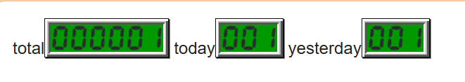
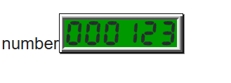

# がうんたー

## 何

画像式アクセスカウンター（PHP）です。



## 必要な環境

たぶんPHP8.1以上、GD関数

## 使い方

gounterフォルダをサーバーにアップロードし、
カウンターを表示したいところで、表示したい種類のPHPファイルを画像として読み込みます。

```html
total <!-- 累計カウンター -->
today <!-- 今日の分 -->
yesterday <!-- 昨日の分 -->
number <!-- 指定した数字 -->
```

`count.php`のみアクセス数の加算が行われます。

共通のルーチンとして、`counter.php`も同じディレクトリに必要です。

画像のサイズ変更、枠の装飾等はcssで行ってください。
サンプルを[tests/test.css](tests/test.css)に置いています。

## 桁数の設定

`counter.php`の定数で、累計と今日・昨日の最小桁数を個別に設定できます。

```php
const TOTAL_MINIMUM_DIGITS = 6; // 累計
const DAILY_MINIMUM_DIGITS = 3; // 今日・昨日
const CUSTOM_MAXIMUM_DIGITS = 12; // 指定数字の最大桁数
```

## おまけ機能 任意の数字を表示

`number.php`の後ろに数字を付けると、DB（Database／データベース）を更新せずにその数字を画像として表示します。

```html

```



URLに書いた数字の文字数が、そのまま表示桁数になります。6桁で表示する場合は、`000123`のように先頭へゼロを付けて指定します。

## DBファイルの保護

DB（Database／データベース）は`gounter/data/count.db`に保存されます。

Unix系環境では、PHPが保存ディレクトリを`0700`、DBファイルを`0600`に設定します。

Apache HTTP Server 2.4では`gounter/data/.htaccess`、Windows ServerのIIS（Internet Information Services）では`gounter/web.config`を使い、`data`ディレクトリ全体へのHTTPアクセスを拒否します。

Windowsの`chmod()`ではNTFS（New Technology File System）のACL（Access Control List）を設定できません。公開時はIISのアプリケーションプールIDだけに`data`ディレクトリの変更権限を与えてください。

PHP内蔵サーバー（`php -S`）やNginxでは`.htaccess`と`web.config`が使われないため、公開環境のサーバー設定で`data`ディレクトリを別途保護してください。

## 素材

いらすとやのものを使用しました。
アクセスカウンターはプロクラムなので「素材が主体」ではないと供述している。

## 画像の変更の仕方

```php
const IMAGE_DIRECTORY = 'images'; // 数字画像を保存したディレクトリ
```

画像の保存ディレクトリを`counter.php`で指定しています。
別のディレクトリに、すべて縦横が同じサイズの0~9のpng画像を数字と同じ名前で入れて下さい。

## 更新履歴

### [2026/08/18] v0.1.0

- アプリのトラッキング防止対策としてURLクエリなしに変更
- おまけ機能追加

### [2026/08/17]

- リポジトリ生やした
